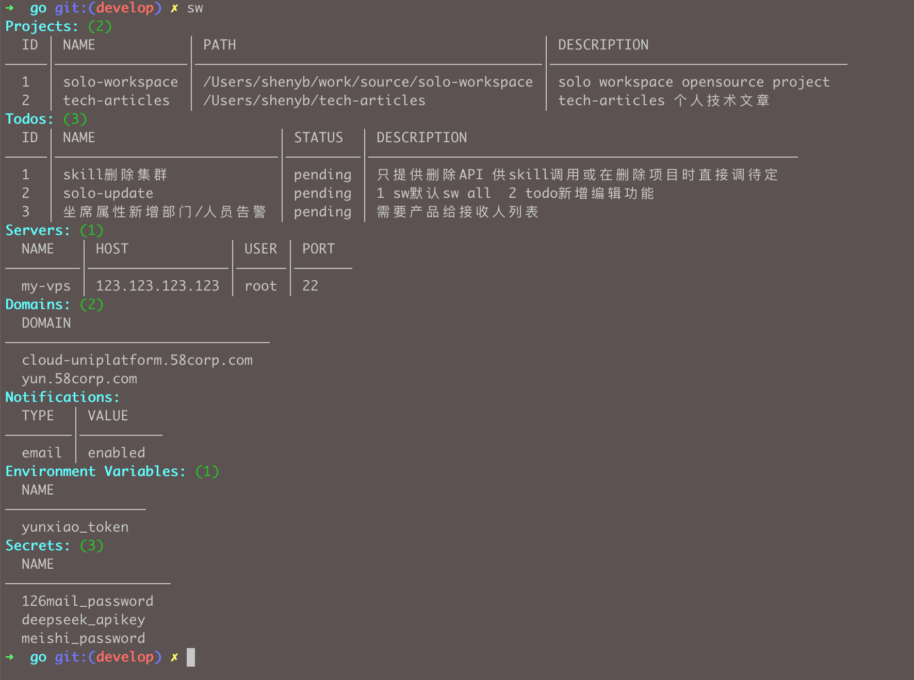
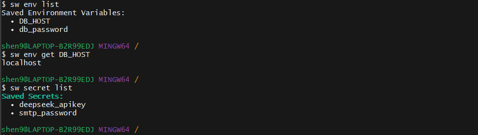
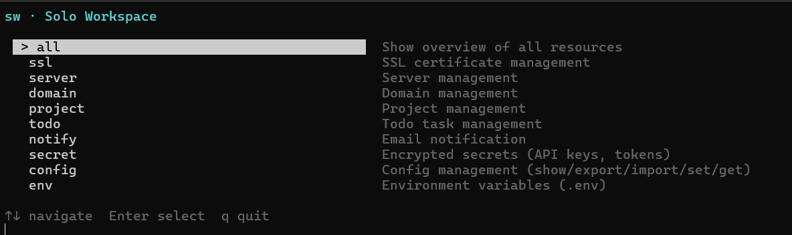
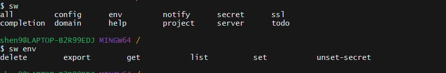

[中文](README_CN.md)

# Solo Workspace

> The open-source operating system for indie developers.

Manage projects, servers, domains, SSL certificates, environment variables, secrets, and more — all from your terminal.

**Open Source · Plugin Architecture · Developer First**

---

## Why Solo Workspace?

As an indie developer, you juggle dozens of tools: a terminal for servers, a spreadsheet for domains, sticky notes for todos, `.env` files scattered across projects, and manual SSL checks. **Solo Workspace** brings it all into one CLI — a single source of truth for your entire indie dev operation.

- **One config file** for servers, domains, projects, and todos
- **Encrypted secrets** so API keys don't sit in plaintext
- **Plugin architecture** — extend with `go` packages, zero framework lock-in
- **Built for indies** — no SaaS, no cloud dependency, your data stays local

---

## Features

| Category | Capability |
|----------|-----------|
| 🖥️ Servers | List, add, update, delete, SSH into configured servers |
| 🌐 Domains | Track domains, check SSL certificates |
| 📁 Projects | CRUD with auto-increment IDs |
| ✅ Todos | Task management with edit, done/reopen (by ID) |
| 🔐 Secrets | AES-256-GCM encrypted storage for API keys & tokens |
| 🌍 Env Vars | Centralized `.env` management with encryption support |
| 📧 Notify | SMTP email alerts (domain expiry, custom messages) |
| ⚙️ Config | YAML/JSON import/export, set/get/delete by path |
| 📋 Overview | `sw` with no args shows all resources at a glance |
| 🎮 TUI | Optional interactive menu (`sw tui`) |
| 📦 Completion | Bash / Zsh / PowerShell tab completion |





*TUI interactive menu (`sw tui`) — optional; CLI commands are the recommended workflow:*



---

## Quick Example

```bash
# Add a server, domain, and project
sw server add my-vps --host 1.2.3.4 --user root --port 22
sw domain add example.com
sw project add my-saas --path ~/code/my-saas --desc "My SaaS product"

# Check SSL certs for all domains
sw ssl check

# Store an API key securely
sw secret set stripe_key "sk_live_xxx"

# See everything at a glance (sw with no args works too)
sw

# Manage todos by ID
sw todo add fix-bug --desc "Fix login issue"
sw todo update 1 --desc "Fix OAuth login"
sw todo done 1

# Optional interactive menu
sw tui
```

---

## Installation

### macOS / Linux
```bash
cd cli/go && go build -o ~/bin/sw . && cd -
```

### Windows (Git Bash)
```bash
cd cli/go && go build -o ~/bin/sw.exe . && cd -
```

### Windows (PowerShell)
```powershell
cd cli\go
go build -o "$env:USERPROFILE\bin\sw.exe" .
```

> **Quick verify:** `sw ssl check`

Add `~/bin` to your `PATH` if it isn't already.

### Shell Completion

```bash
sw completion install bash   # or zsh, fish, powershell
```



---

## Configuration

SW loads config in this order (first found wins):

| Priority | Path | Use Case |
|----------|------|----------|
| 1 | `-c <path>` / `--config <path>` | Manual override |
| 2 | `~/.solo/config.yaml` | Global settings (all projects) |
| 3 | `.solo.yaml` (cwd) | Per-project config |
| 4 | _(none)_ | Empty defaults |

Data files (`env.yaml`, `secrets.enc`) live alongside the active config file — when using the default `~/.solo/config.yaml` they stay in `~/.solo/`; when using `-c /path/to/config.yaml` they follow to `/path/to/`.

**Minimal `~/.solo/config.yaml`:**

```yaml
servers:
  my-vps:
    host: 123.123.123.123
    user: root
    port: 22

domains:
  - example.com

notify:
  email:
    enabled: true
    host: smtp.example.com
    port: 587
    username: user@example.com
    password: app-password
    from: user@example.com
    to:
      - admin@example.com
```

> 📖 Full command reference: [cli/docs/command.md](cli/docs/command.md)

---

## Plugin Architecture

Each feature is a self-contained plugin — a Lego brick you can swap or extend:

```
cli/go/
├── cmd/                # CLI entry point (cobra + TUI)
├── internal/           # Config, output, plugin interface
├── plugins/
│   ├── ssl/            # SSL certificate management
│   ├── server/         # Server management
│   ├── domain/         # Domain management
│   ├── project/        # Project CRUD
│   ├── todo/           # Todo management
│   ├── notify/         # Email notifications
│   ├── config/         # Config import/export/set/get
│   ├── env/            # Environment variables
│   └── secret/         # AES-256-GCM encrypted secrets
└── main.go
```

**Add a plugin in 3 steps:**
1. Create `cli/go/plugins/<name>/plugin.go`
2. Implement the cobra command
3. Register in `cli/go/cmd/root.go`

---

## Roadmap

| Version | Status | Highlights |
|---------|--------|------------|
| v0.1 | ✅ Done | Plugin architecture, SSL check, server SSH, domains, todos, notifications |
| v0.2 | ✅ Current | Env vars, secrets, config import/export, ID-based project/todo CRUD, overview & TUI polish |
| v0.3 | 🔨 Planned | Project relationships, cost tracking, SQLite backend |
| v0.4 | 📋 Planned | Docker integration, GitHub integration |
| v1.0 | 🚀 Future | Web dashboard, plugin marketplace |

> 📖 Full roadmap with backlog: [cli/docs/roadmap.md](cli/docs/roadmap.md)

---

## Contributing

Contributions welcome! The plugin architecture makes it easy to add new features.

1. Fork the repo
2. Create a plugin under `cli/go/plugins/<name>/`
3. Register it in `cli/go/cmd/root.go`
4. Open a PR

---

## License

MIT © Solo Workspace
