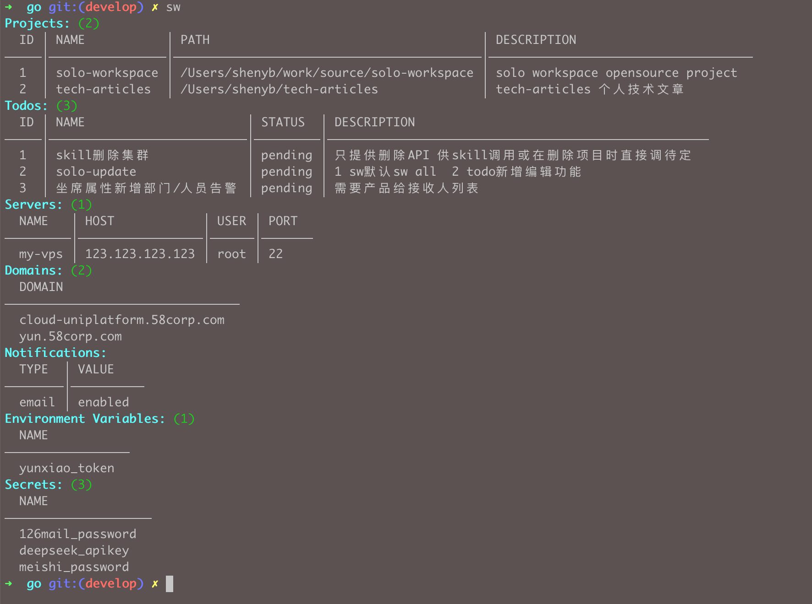

# Solo Workspace

> 独立开发者的项目集合。

**解决什么问题：** 一个人做侧车/副业时，VPS、域名、SSL、密钥、`.env`、待办散落在备忘录和 shell 历史里。`sw` 用本地 CLI 把它们收拢到一处。

| | |
|--|--|
| **你得到什么** | 服务器、域名+SSL、项目、待办、加密 secrets/env、日志、总览与可选 TUI |
| **安装** | 下方一行命令 → `sw --version` |
| **博客** | [ganhuo.dev](https://ganhuo.dev) |
| **反馈 / 合作** | [shenyanbin1234@gmail.com](mailto:shenyanbin1234@gmail.com) |

---

## 特性总览

| 分类 | 功能 |
|------|------|
| 🖥️ 服务器 | 增删改查、SSH 登录已配置的服务器 |
| 🌐 域名 | 跟踪域名、检测 SSL 证书 |
| 📁 项目 | 自增 ID 的增删改查 |
| ✅ 待办 | 编辑、完成/重开（按 ID）；支持备注、统计、两周无操作自动归档 |
| 🔐 密钥 | AES-256-GCM 加密存储 API Key / Token |
| 🌍 环境变量 | 集中管理 `.env`，支持加密 |
| 📝 日志 | 快速时间戳日志 — `sw log "修复了登录 bug"` |
| 📧 通知 | SMTP 邮件提醒（域名过期、自定义消息） |
| ⚙️ 配置 | YAML/JSON 导入导出、按路径 set/get/delete |
| 📋 总览 | `sw` 不加参数，一览所有资源 |
| 🎮 TUI | 可选的交互菜单 (`sw tui`) |
| 📦 补全 | Bash / Zsh / PowerShell Tab 补全 |




*TUI 交互菜单 (`sw tui`) — 可选；CLI 命令模式是推荐工作流：*


---

## 快速上手

```bash
# 添加服务器、域名、项目
sw server add my-vps --host 1.2.3.4 --user root --port 22
sw domain add example.com
sw project add my-saas --path ~/code/my-saas --desc "我的 SaaS 产品"

# 检查所有域名的 SSL 证书
sw ssl check

# 安全存储 API Key
sw secret set stripe_key "sk_live_xxx"

# 一览所有资源（`sw` 不加参数也一样）
sw

# 按 ID 管理待办
sw todo add fix-bug --desc "修复登录问题"
sw todo update 1 --desc "修复 OAuth 登录"
sw todo note 1 "根因：缓存未失效"
sw todo done 1
sw todo stats                       # 查看统计汇总
sw todo archive run              # 归档两周无操作的待办
sw todo archive list             # 查看已归档的待办

# 快速日志
sw log "修复了登录 OAuth bug"      # 带时间戳的记录
sw log today                        # 查看今天记录
sw log since 3d                     # 查看最近 3 天

# 跳转到项目目录（添加到 shell：swj() { cd "$(sw project path "$1")"; }）
cd "$(sw project path 1)"

# 可选交互菜单
sw tui
```

---

## 安装

### macOS / Linux（一行命令）
```bash
curl -sSL https://github.com/shenyb/solo-workspace/releases/latest/download/install.sh | sh
```

然后将 `~/bin` 加入 `PATH`：
```bash
echo 'export PATH="$HOME/bin:$PATH"' >> ~/.zshrc && source ~/.zshrc
```

> **快速验证：** `sw --version`

### Windows

从 [Releases](https://github.com/shenyb/solo-workspace/releases/latest) 下载最新的 `sw-windows-amd64.exe`，重命名为 `sw.exe`，放入 `PATH` 中的目录即可。

### 源码编译
```bash
cd cli/go && go build -o ~/bin/sw . && cd -
```

### Shell 补全

```bash
sw completion install bash   # 或 zsh, fish, powershell
```


---

## 配置

SW 按以下优先级加载配置（优先找到的生效）：

| 优先级 | 路径 | 使用场景 |
|--------|------|----------|
| 1 | `-c <路径>` / `--config <路径>` | 手动指定 |
| 2 | `.solo.yaml`（当前目录） | 项目级配置 |
| 3 | `~/.solo/config.yaml` | 全局设置（所有项目） |
| 4 | _(无)_ | 空默认值 |

数据文件（`env.local`、`secrets.enc`）与当前配置同目录 — 使用默认 `~/.solo/config.yaml` 时存放在 `~/.solo/`；使用 `-c` 指定配置时跟随到对应目录。

**最小 `~/.solo/config.yaml`：**

```yaml
servers:
  my-vps:
    host: 123.123.123.123
    user: root
    port: 22

domains:
  - example.com

notify:
  email:
    enabled: true
    host: smtp.example.com
    port: 587
    username: user@example.com
    password_secret: smtp_password   # 推荐：通过 sw secret set 存储
    # password: app-password         # 或明文（不推荐）
    from: user@example.com
    to:
      - admin@example.com
```

> 📖 完整命令参考：[cli/docs/command.md](cli/docs/command.md)

---

## 插件架构

每个功能都是独立插件——可替换可扩展的积木块：

```
cli/go/
├── cmd/                # CLI 入口（cobra + TUI）
├── internal/           # 配置、输出、插件接口
├── plugins/
│   ├── ssl/            # SSL 证书管理
│   ├── server/         # 服务器管理
│   ├── domain/         # 域名管理
│   ├── project/        # 项目 CRUD（含 path 支持 cd）
│   ├── todo/           # 待办管理（备注、统计、归档）
│   ├── notify/         # 邮件通知
│   ├── log/            # 快速时间日志
│   ├── config/         # 配置导入导出
│   ├── env/            # 环境变量
│   └── secret/         # AES-256-GCM 加密存储
└── main.go
```

**三步添加一个插件：**
1. 创建 `cli/go/plugins/<名称>/plugin.go`
2. 实现 cobra 命令
3. 在 `cli/go/cmd/root.go` 注册

---

## 相关项目

| 项目 | 说明 |
|------|------|
| [solo-spring-scaffold](https://github.com/shenyb/solo-spring-scaffold) | Spring Boot 3.x 项目脚手架生成器 |
| [reviewbot](https://github.com/shenyb/reviewbot) | AI 代码审查机器人（DeepSeek） |

---

## 路线图

| 版本 | 状态 | 亮点 |
|------|------|------|
| v0.1 | ✅ 完成 | 插件架构、SSL 检测、服务器 SSH、域名、待办、通知 |
| v0.2 | ✅ 当前 | 环境变量、密钥、配置导入导出、按 ID 操作项目/待办、待办备注与统计、项目路径跳转、时间日志、总览与 TUI 优化 |
| v0.3 | 🔨 规划中 | 待办统计增强、项目关联、成本追踪、SQLite 后端 |
| v0.4 | 📋 已计划 | Docker 集成、GitHub 集成 |
| v1.0 | 🚀 未来 | Web 面板、插件商店 |

> 📖 完整路线图及 Backlog：[cli/docs/roadmap.md](cli/docs/roadmap.md)

---

## 参与贡献

欢迎贡献！插件架构让添加新功能非常简单。

1. Fork 仓库
2. 在 `cli/go/plugins/<name>/` 下创建插件
3. 在 `cli/go/cmd/root.go` 注册
4. 提交 PR

---

## 许可证

MIT © Solo Workspace

---

📬 **关于我 / 更多内容**

- 📝 博客：[干货·工程化复盘](https://ganhuo.dev) — 生产环境事故复盘与工程化实战
- 💬 掘金：[申延彬的技术文章](https://juejin.cn/user/920709300225227/posts)
- 🧑‍💼 知乎：[申延彬的知乎主页](https://www.zhihu.com/people/shen-bin-88-64/posts)
- ✉️ 邮箱：[shenyanbin1234@gmail.com](mailto:shenyanbin1234@gmail.com) — 反馈、轻咨询、合作